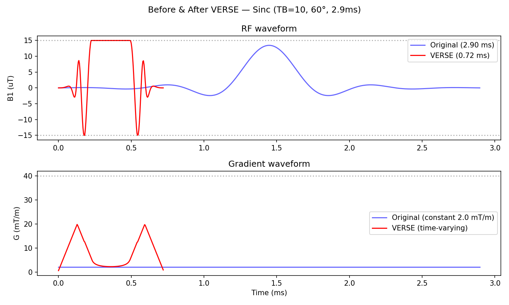
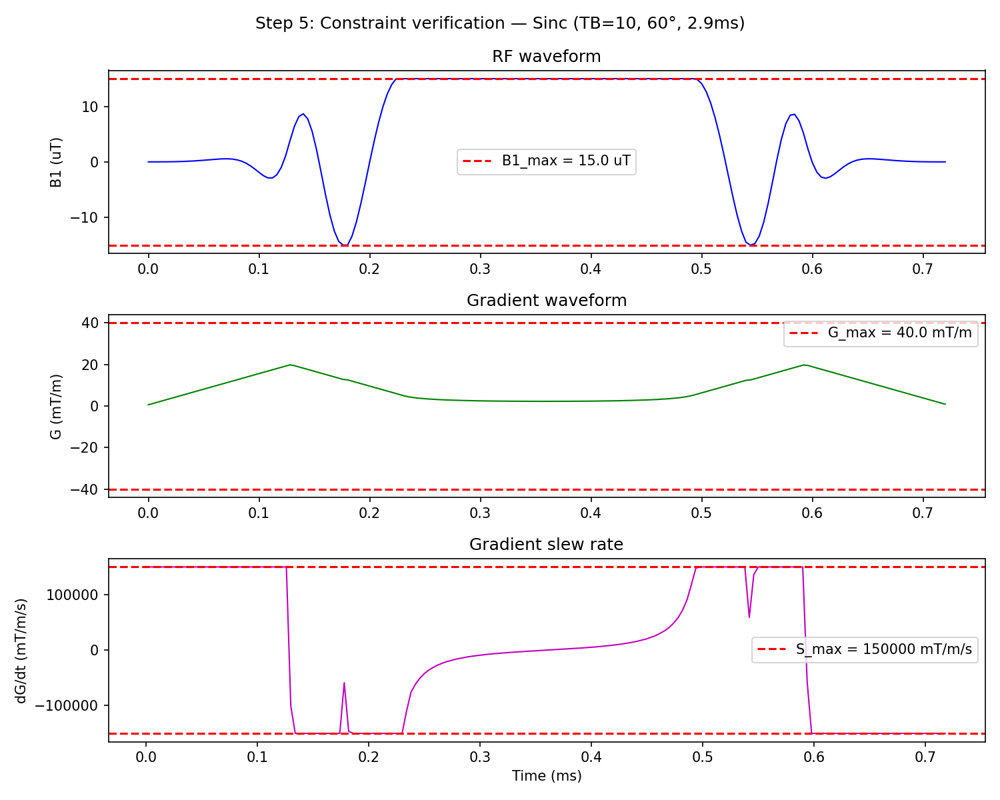

# VERSE Pulse Optimizer — Compress MRI RF Pulses to Minimum Duration

A Python implementation of **Variable-Rate Selective Excitation (VERSE)** for MRI pulse design. Upload any RF pulse waveform and compress it to the shortest possible duration while respecting hardware limits (RF amplitude, gradient strength, slew rate). Based on the algorithm by Hargreaves et al. (2004).

**[Try it in your browser](https://carefulCamel61097.github.io/verse-pulse-optimizer/)** — no install needed. Run the built-in example (the same TB=10 sinc shown below) to see VERSE in action, or upload your own pulse and download the compressed version.

## The principle

In MRI, a selective RF pulse is played together with a gradient to excite a specific slab of tissue. The excitation profile (which tissue gets excited, and by how much) depends on the *integral* of the RF waveform over time. This means you can make the pulse shorter — as long as you scale up the RF amplitude and gradient to compensate, the excitation profile stays the same.

The tradeoff: compressing the pulse increases the RF amplitude, the gradient strength, and how fast the gradient changes (slew rate). All three have hardware safety limits. So the question becomes: **how short can we make the pulse before we hit a limit?**

The VERSE approach: compress the pulse non-uniformly. At moments where the RF is weak (e.g., zero-crossings of a sinc), there's room to compress aggressively. At the peaks, the RF amplitude is already high, so less compression is possible. The optimal pulse hits at least one safety limit at every moment in time.



*A TB=10 windowed sinc pulse compressed from 2.9 ms to 0.72 ms (4x) while respecting all hardware limits.*

## How it works

A standard selective RF pulse is played with a constant gradient. VERSE introduces a time-dilation function that "speeds up" time at each point. To preserve the excitation profile, the RF and gradient must scale accordingly:

$$B_1'(t) = B_1(\tau) \cdot \dot{\tau}(t) \qquad G'(t) = G \cdot \dot{\tau}(t)$$

The algorithm finds the maximum $\dot{\tau}$ at each point, subject to three constraints:

| Constraint | Limit | What it protects |
|---|---|---|
| RF amplitude | $\|B_1'\| \leq B_{1,\text{max}}$ | RF amplifier |
| Gradient amplitude | $\|G'\| \leq G_{\text{max}}$ | Gradient coils |
| Gradient slew rate | $\|dG'/dt\| \leq S_{\text{max}}$ | Gradient amplifier / patient safety |

The gradient naturally ramps up from zero and back down -- no separate ramp handling needed. The slew rate constraint creates these ramps automatically.



*Final VERSE pulse with all three constraints shown. The slew rate stays within limits throughout.*

See [20260329 VERSE Outline.md](20260329%20VERSE%20Outline.md) for a detailed walkthrough of the algorithm and the math behind each step.

## Quick start

```bash
pip install -r requirements.txt
python verse_optimizer.py
```

This runs the default example (TB=10 windowed sinc, 60° flip angle) and produces:
- Diagnostic plots at each algorithm step
- A comparison plot (original vs VERSE)
- An output file `verse_pulse_output.txt` with the compressed pulse

## Trying different pulses

Three premade pulses are included. Edit the selection block near the top of `verse_optimizer.py`:

```python
B1, G_orig, dt, pulse_name = make_sinc_pulse(TB=10, T_pulse=2.9e-3, flip_angle=60)
# B1, G_orig, dt, pulse_name = make_sinc_pulse(TB=5, T_pulse=1.5e-3, flip_angle=60)
# B1, G_orig, dt, pulse_name = make_gaussian_pulse(T_pulse=2.0e-3, flip_angle=60)
# B1, G_orig, dt, pulse_name = make_block_pulse(T_pulse=0.5e-3, flip_angle=90)
```

## Hardware limits

Adjust these at the top of the script to match your scanner:

```python
B1_max = 15.0       # Maximum RF amplitude, uT
G_max = 40.0        # Maximum gradient amplitude, mT/m
S_max = 150e3       # Maximum gradient slew rate, mT/m/s
```

## Output format

The output file (`verse_pulse_output.txt`) contains tab-separated columns:

| Column | Unit | Description |
|---|---|---|
| `time_us` | us | Time axis |
| `B1_uT` | uT | RF amplitude |
| `G_mTm` | mT/m | Gradient amplitude |

Load in MATLAB: `data = load('verse_pulse_output.txt');`
Load in Python: `data = np.loadtxt('verse_pulse_output.txt')`

## MATLAB compatibility

The code is written in NumPy array style (no classes, no Python-specific idioms) for straightforward translation to MATLAB. Key mappings:

| Python/NumPy | MATLAB |
|---|---|
| `np.sinc(x)` | `sinc(x)` |
| `np.hamming(N)` | `hamming(N)` |
| `np.interp(xq, x, y)` | `interp1(x, y, xq)` |
| `np.diff(x)` | `diff(x)` |
| `np.minimum(a, b)` | `min(a, b)` |
| `a[0]` (0-indexed) | `a(1)` (1-indexed) |

## Reference

Hargreaves BA, Cunningham CH, Nishimura DG, Conolly SM. Variable-rate selective excitation for rapid MRI sequences. *Magn Reson Med.* 2004;52(3):590-597. [doi:10.1002/mrm.20168](https://doi.org/10.1002/mrm.20168)

## License

MIT
